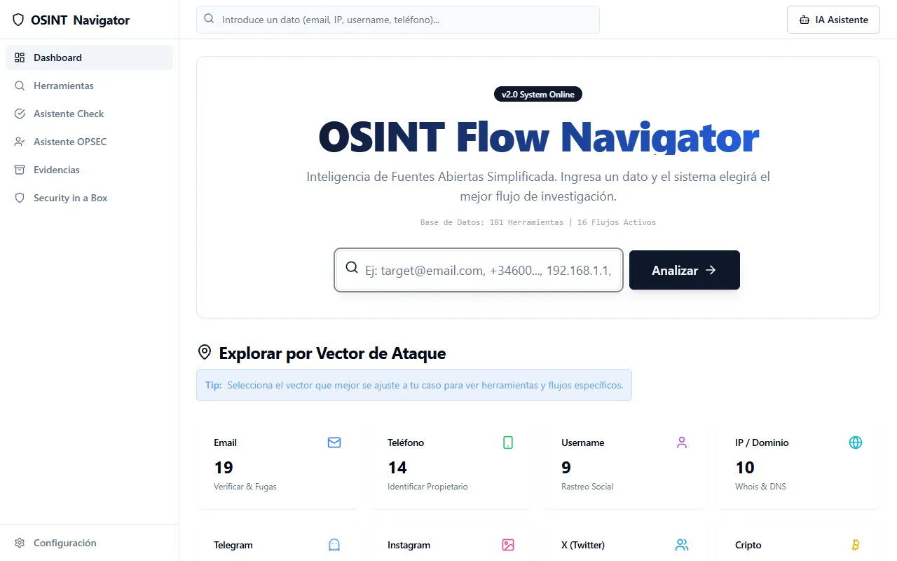
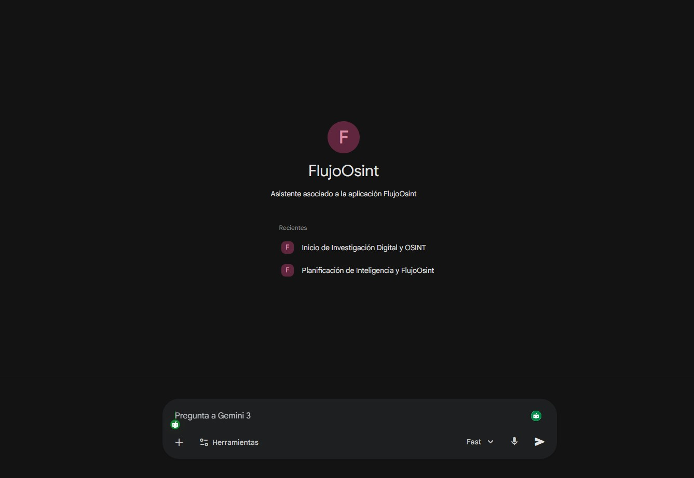
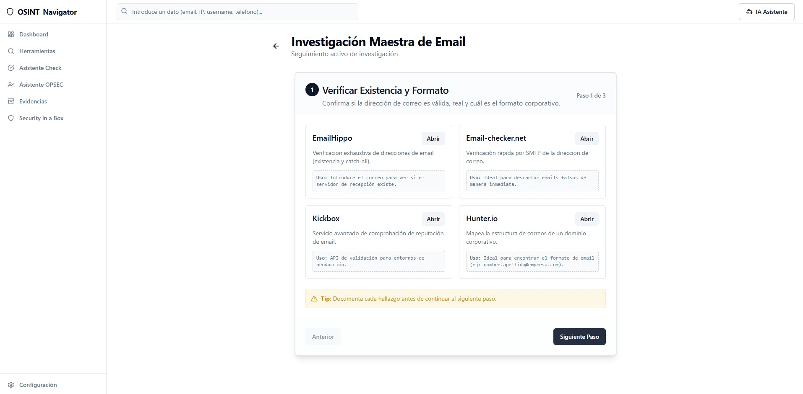

# 🔍 OSINT Flow Navigator

### 📸 Capturas de Pantalla

| Página Principal | Vista de Categorías |
|:---:|:---:|
|  |  |
| **Asistente de Procesamiento** | **Guía de Seguridad (OPSEC)** |
|  |  |
**OSINT Flow Navigator** es una aplicación web interactiva diseñada para asistir a investigadores OSINT (Open-Source Intelligence), periodistas, y analistas de ciberseguridad en sus procesos de investigación. 

La herramienta proporciona una interfaz limpia, profesional y libre de fricciones que guía a los usuarios a través de flujos de trabajo estructurados dependiendo del dato inicial que se posea (Ej: Correo, IP, Teléfono, Username, etc.), pivotando hacia herramientas específicas, sin recolectar ni almacenar información personal en servidores externos.

---

## 🚀 Acceso Rápido
**[🌐 Abrir OSINT Flow Navigator](https://omrpps.github.io/osint-flow-navigator/)**

---

## 🛠️ Características Principales

- **Flujos de Trabajo Guiados:** Más de 20 categorías de investigación (Emails, Teléfonos, Redes Sociales, Dark Web, Criptomonedas, etc.).
- **Catálogo de Herramientas:** Acceso organizado a más de 300 herramientas OSINT curadas y verificadas.
- **Asistente de Procesamiento:** Un asistente paso a paso para recomendar herramientas según la evidencia tecnológica.
- **Módulo de Evidencias:** Herramientas recomendadas y flujos de trabajo para la preservación legal y segura de evidencias digitales (Webs, Videos y metadatos).
- **Inteligencia Artificial:** Asistente Especializado en OSINT y OPSEC (Gemini) integrado para guiar en investigaciones.
- **Seguridad y OPSEC:** Sección dedicada a tácticas de seguridad operacional para mantener el anonimato y la seguridad durante las investigaciones.
- **Totalmente Client-Side:** Todo el código se ejecuta en tu navegador. Tus datos e investigaciones nunca salen de tu ordenador.

## 💻 Desarrollo Local

Este proyecto está construido con React y Vite.

### Requisitos Previos
- Node.js versión 18+ o superior.

### Instalación
1. Clona el repositorio:
   ```bash
   git clone https://github.com/omrpps/osint-flow-navigator.git
   cd osint-flow-navigator
   ```

2. Instala las dependencias:
   ```bash
   npm install
   ```

3. Inicia el servidor de desarrollo local:
   ```bash
   npm run dev
   ```

## 🌍 Despliegue en Producción (GitHub Pages)

Para actualizar la web en vivo después de hacer cambios en el código local:
1. Asegúrate de haber guardado tus cambios (`git commit`).
2. Ejecuta el comando de despliegue:
   ```bash
   npm run deploy
   ```
*(Este comando compilará la aplicación y la subirá automáticamente a la rama `gh-pages`)*.

---
*Si tu carpeta está alojada en Google Drive o OneDrive de forma nativa localmente, asegúrate de pausar la sincronización en la nube antes de instalar NPM para evitar errores 404/locks.*
